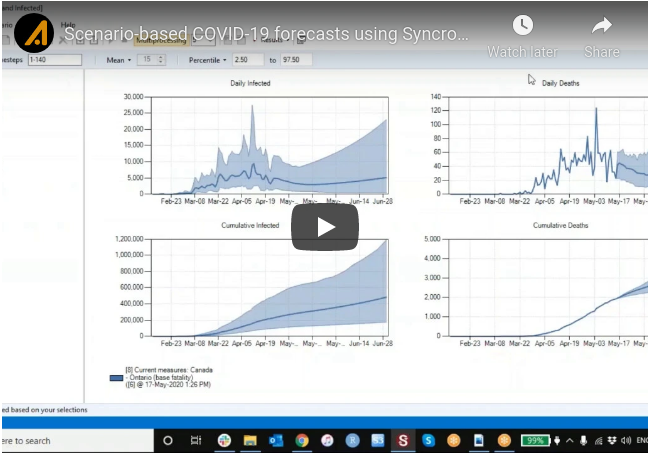

## Getting started with **Epidemic**: a COVID-19 model example

&nbsp;

A prototype version of our framework, including a case study example providing real-time daily [online COVID-19 forecasts](https://apexrms.shinyapps.io/covid19canada/) for Canada and its provinces, is demonstrated through [this short video](http://www.youtube.com/watch?feature=player_embedded&v=txtFYwzLoIY).

&nbsp;

Additional details are provided in an accompanying [whitepaper](http://apexrms.com/dwnld/covid-19-canada-framework-whitepaper.pdf).

&nbsp;

#### To generate daily COVID-19 forecasts for your jurisdiction:

1. Download and install SyncroSim
2. Open SyncroSim and select **File -> Packages… -> Install…**, select the epidemic Package and click OK.
3. Create a new model library using the latest COVID-19 template library for Canada by selecting **File -> New Library…** then selecting the epidemic base package and the COVID-19 Canada template. *Note: template libraries are updated daily with the latest Canadian and international data ensuring that new libraries generate updated real-time forecasts every day*.
4. Select the scenario you would like to simulate (e.g., “*Current measures: Canada (base fatality)*”) and select **Scenario -> Run** to run the simulation.
5. View the results by double-clicking on the Deaths and Infected chart on the lower left of the Library Explorer window.

*Visit the [ApexRMS website](https://apexrms.com/covid-19-modeling/) for more on our work to model the COVID-19 pandemic*
