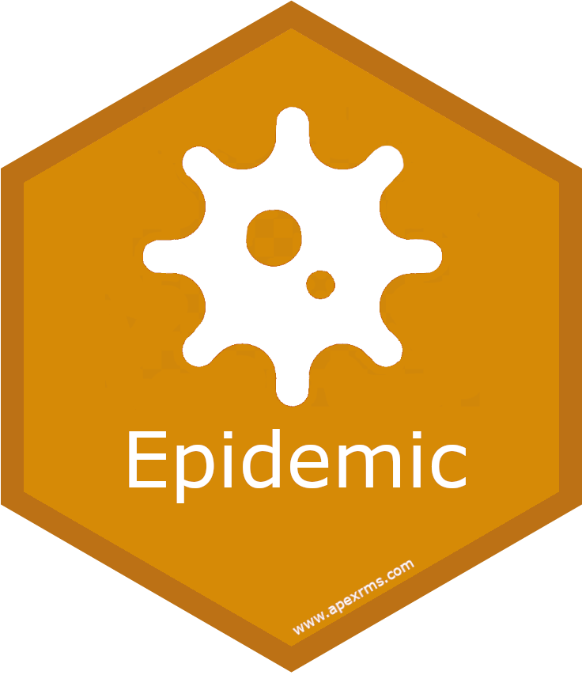
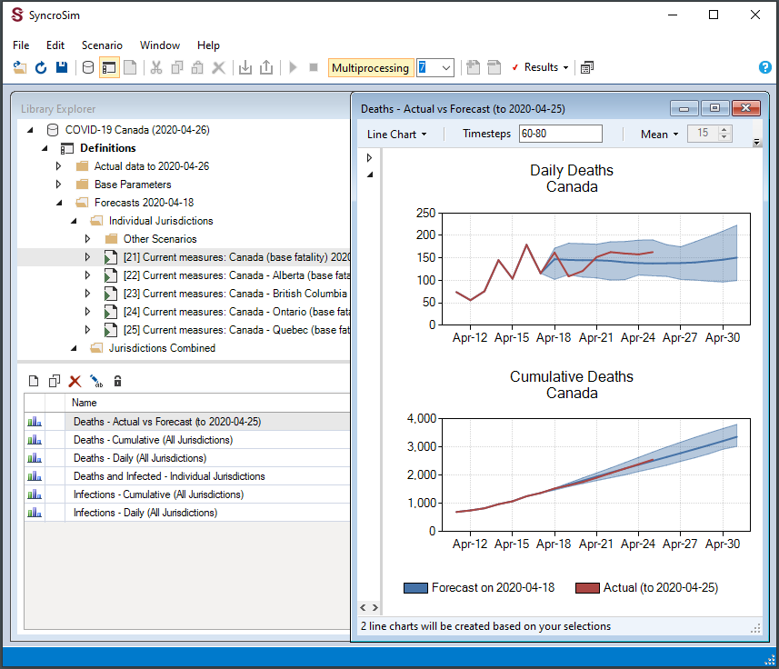

# **Epidemic** Syncrosim Package

 <a href="https://github.com/ApexRMS/epidemic">
 

 
## Model of epidemic infections and deaths
### *Epidemic* is an open-source [SyncroSim](https://syncrosim.com/) Base Package that provides a general framework for developing scenario-based stochastic models of future daily epidemic infections and deaths.

The **Epidemic** package framework has been developed to produce real-time forecasts of COVID-19 infections and deaths that can be rapidly deployed for use anywhere in the world. Built upon the [SyncroSim](https://syncrosim.com/) software platform, **Epidemic** takes as input a time series of real-time reported case and death data along with different modeling approaches for forecasting and scenario analyses. **Epidemic** uses the latest source control techniques, allowing for continuous adaptions and improvements to be applied to the framework’s underlying models as understanding of COVID-19 evolves over time.

The modeling framework behind **Epidemic** is general enough that it may be applied to any jurisdiction and any disease. As such, the framework allows decision makers to assess and compare alternative model projections for local accuracy and relevance, thus building confidence over time in their forecasts. Furthermore, the **Epidemic** framework provides policy makers with the flexibility to introduce their own local “what-if” scenarios regarding the effects of possible future changes to public health measures. The result is a tool that generates locally responsive, meaningful, and ultimately actionable forecasts.

### Requirements

This package requires Syncrosim [version 2.2.27](https://syncrosim.com/download/).

### How to install

Open SyncroSim and select **File -> Packages… -> Install…**, then select the **epidemic** package and click OK.

Alternatively, download [the latest release from Github](https://github.com/ApexRMS/epidemic/releases/). Open Syncrosim and navigate to packages, then install from file.

### Developers

Colin Daniel (Author, maintainer)
 
Leonardo Frid (Author) 
 
Alex Embrey (Author)
